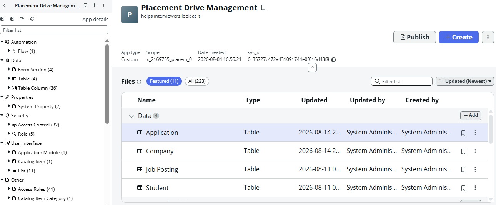
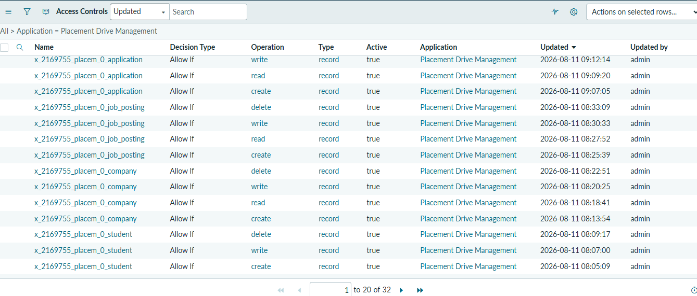
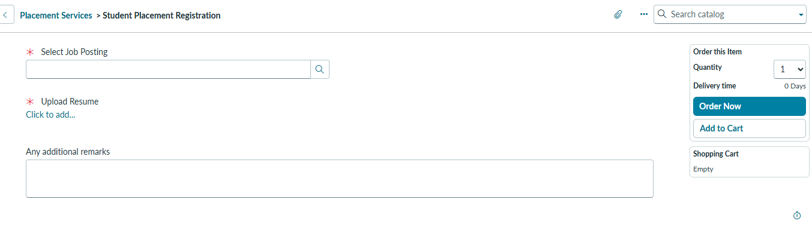
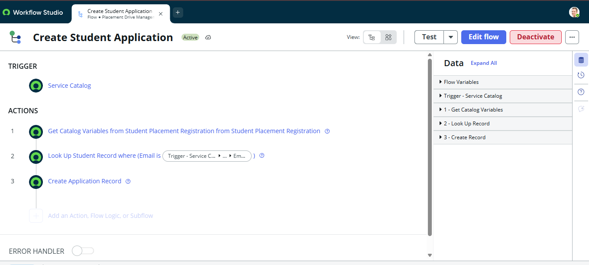
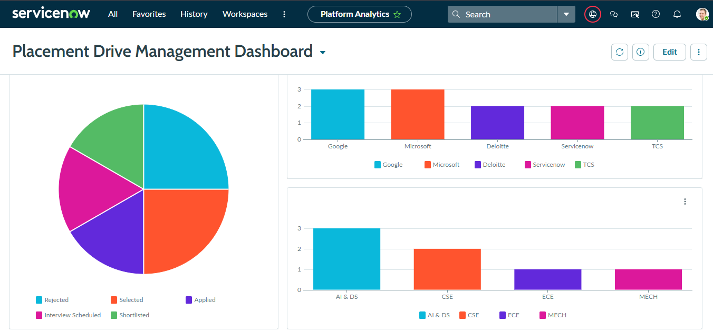

# Placement Drive Management — ServiceNow Scoped Application
 
A custom-built ServiceNow application that automates a campus placement drive — connecting students, companies, job postings, and applications through role-based access, a self-service intake form, and Flow Designer automation.
 
Built end-to-end on a ServiceNow PDI (Australia release) as a hands-on demonstration of core CSA-level skills: data modeling, security, Service Catalog design, process automation, and reporting.
 
 ---
 
## Problem
 
Campus placement drives are typically run over spreadsheets and email — no central data, no audit trail, no self-service visibility for students into job eligibility or application status.
 
This app replaces that with a single system of record: companies and job postings are centrally managed, students self-apply through a Service Catalog form, and status moves through automation instead of manual re-entry.
 
---
 
## Architecture
 
**4 custom tables, linked by Reference fields:**
 
```
Company → Job Posting → Application ← Student
```
 
| Table | Key Fields |
|---|---|
| Student | First Name, Last Name, Email, Roll Number, Department, CGPA, Placement Status |
| Company | Company Name, Industry, HR Contact, HR Email, Package Offered, Location, Status |
| Job Posting | Job Title, Company (ref), Description, Eligibility CGPA, Eligible Departments, Deadline, Status |
| Application | Student (ref), Job Posting (ref), Application Date, Status, Interview Date, Remarks |
 

 
---
 
## Security Model
 
Three custom roles, mapped to table-level ACLs (Create/Read/Write/Delete):
 
| Role | Access |
|---|---|
| `placement_officer` | Full CRUD on all 4 tables |
| `hr_recruiter` | Create/Read/Write on Job Posting, Read on Application |
| `student_user` | Read-only on Student & Job Posting, Create/Read on Application |
 

 
> **Known limitation:** ACLs restrict by table/operation, not by record ownership — a scripted ACL condition (comparing session user to the linked Student record) would be needed for true row-level isolation. Scoped as a future CAD-level enhancement.
 
---
 
## Self-Service Intake — Service Catalog
 
Students apply through a catalog item, **Student Placement Registration**, instead of touching raw tables:
 
- **Select Job Posting** — Reference variable
- **Upload Resume** — Attachment variable
- **Additional Remarks** — optional Multi Line Text
Student identity is resolved automatically from the logged-in session — not collected on the form.
 

 
---
 
## Automation — Flow Designer
 
```
Trigger (Service Catalog)
   → Get Catalog Variables
   → Lookup Record (match Student by Email)
   → Create Record (Application, Status = "Applied")
```
 
`Application Date` is set automatically via a table-level default value (`javascript:new GlideDateTime()`), keeping the flow focused on business logic only.
 

 
---
 
## Reporting — Platform Analytics
 
| Visualization | Type | Insight |
|---|---|---|
| Applications by Status | Pie Chart | Distribution across Applied / Shortlisted / Interview / Selected / Rejected |
| Applications by Company | Vertical Bar | Which companies draw the most candidates |
| Students by Department | Vertical Bar | Departmental participation |
 

 
---
 
## Change Management

Project work was tracked using a dedicated Update Set (`Placement Drive Management - v1`), marked Complete on project sign-off. *(Note: bulk of initial build predated this update set and was captured under Default — a process gap identified and corrected mid-project, and a good reminder to always create your update set before writing a line of config.)*
---
 
## Skills Demonstrated
 
- Custom table & relational data modeling (Reference fields)
- Role-Based Access Control (ACLs) and custom role design
- Service Catalog design (catalog items, variables, variable types)
- Flow Designer automation (trigger, actions, data pill mapping)
- Platform Analytics reporting & dashboards
- Application scoping and Update Set change management
---
 
## Tech Stack
 
ServiceNow · Studio · Flow Designer · Service Catalog · Access Control (ACL) · Platform Analytics
 
---
 
**Author:** Amal Krishna J — CSA Certified | Aspiring ServiceNow Developer/Technical Consultant
 
